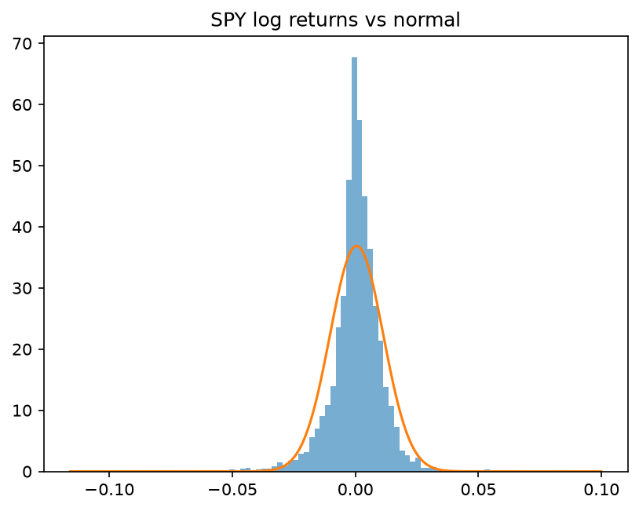
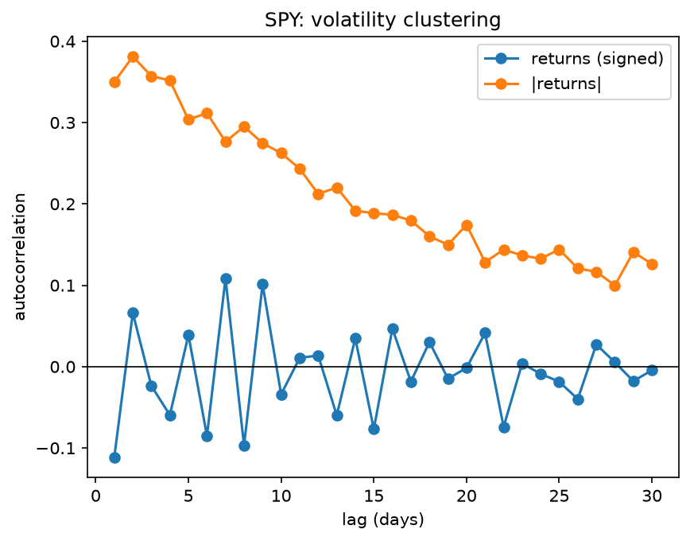
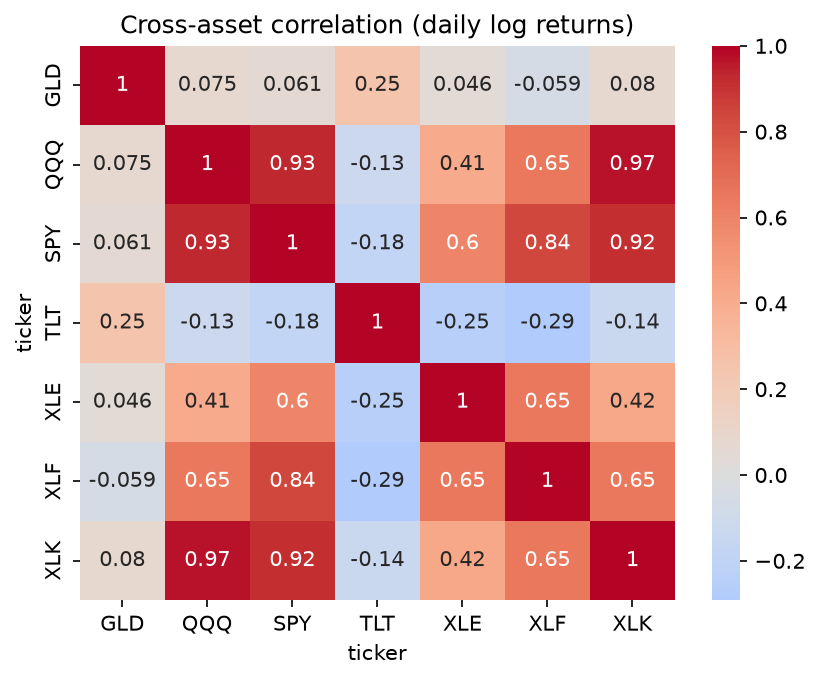

# Financial Data Pipeline & Stylized Facts of Returns
An end-to-end pipeline that ingests, validates, and stores daily equity and crypto price data in SQLite, then analyses the empirical properties of asset returns: fat tails, volatility clustering, and cross-asset correlation.

## Motivation
I hold a BSc in Mathematics and an MSc in Finance, and I work in reserve management at a central bank. I have a strong quantitative foundation and a genuine interest in systematic and quantitative approaches to markets, but my hands-on data-engineering experience was thinner than my degrees suggested. I built this project to close that gap: every line is my own, written to understand rather than to impress. It's the first firm step toward the deeper quantitative work I want to grow into.

## Pipeline / Architecture

The project is organised as a linear pipeline, each stage feeding the next:

**yfinance → clean DataFrame → SQLite → returns → analysis**
- Downloader (`src/downloader.py`): fetches daily OHLCV data from yfinance, uses adjusted close, and raises an error on empty results rather than failing silently.
- Database (`src/database.py, src/checks.sql`): stores prices in SQLite across two tables (instruments, prices), plus a set of SQL validation queries.
- Returns (`src/returns.py`): computes simple and log returns, rolling annualised volatility, and maximum drawdown.
- Analysis (`notebooks/stylized_facts.ipynb`): documents three empirical properties of returns.

**Design decisions**
- Idempotent storage. The `prices` table uses a composite (`ticker, date`) primary key with `INSERT OR REPLACE`, so re-running the pipeline updates existing rows instead of creating duplicates: the loader is safe to run repeatedly.
- Automated data validation. `checks.sql` verifies row counts, duplicate detection, date-sequence gaps, and extreme daily moves. This surfaced a real event (XLE falling ~20% on 2020-03-09 - the Saudi–Russia oil-price war) rather than a data error.
- Prices stored, returns computed on demand. The database holds only raw prices as the source of truth; returns and other derived quantities are recomputed in memory, so changing a calculation never requires rewriting stored data.

## Findings

### 1. Fat tails



Fat tails. SPY's daily returns are far more extreme-prone than a normal distribution predicts. The histogram has a much taller peak and noticeably fatter tails than the fitted normal curve (orange), and the excess kurtosis of ≈ 15 (versus 0 for a normal distribution) quantifies this. In practice this matters for risk: models that assume normality treat large moves as almost impossible, so they systematically underestimate the likelihood of a crash.

### 2. Volatility clustering



Volatility clustering. The chart separates two things. The direction of returns is essentially unpredictable: signed returns show near-zero autocorrelation at every lag, so yesterday's move tells you little about whether today is up or down. But the magnitude is predictable: the autocorrelation of absolute returns stays clearly positive and decays slowly, meaning large moves tend to follow large moves and calm follows calm. This is volatility clustering, and it violates the independence assumption behind naïve √252 annualisation.

### 3. Cross-asset correlation



Cross-asset correlation. The equity ETFs (SPY, QQQ, XLK, XLF, XLE) are highly correlated with one another (the deep-red block) so holding several of them provides little real diversification. TLT (long-term Treasuries) is negatively correlated with equities, making it a genuine diversifier that tends to rise when stocks fall. Gold (GLD) is close to uncorrelated with everything, moving on its own drivers. This illustrates that diversification comes from mixing asset classes, not from holding many correlated stocks.

## How to run

```bash
# clone and enter the repo
git clone https://github.com/Alenchikk1/financial-data-pipeline.git
cd financial-data-pipeline

# set up the environment
python3 -m venv venv
source venv/bin/activate
pip install -r requirements.txt

# build the database (downloads the 7-asset universe into SQLite)
python src/load_universe.py

# run the data-quality checks
sqlite3 data/market.db < src/checks.sql

# then open notebooks/stylized_facts.ipynb to reproduce the analysis
```

## Tech stack

- **Python** (pandas, numpy) — data manipulation and returns computation
- **SQLite** — storage and SQL validation queries
- **matplotlib, seaborn, scipy** — analysis and visualisation
- **yfinance** — market data source
- **Git / GitHub** — version control